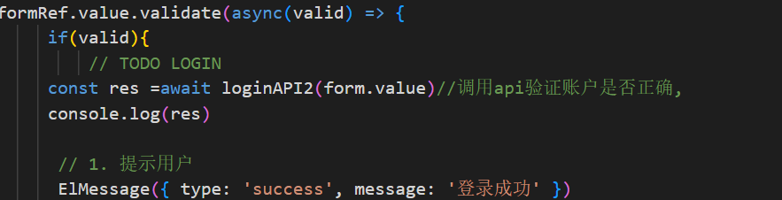

# SuperShop

This template should help get you started developing with Vue 3 in Vite.

## Recommended IDE Setup

[VSCode](https://code.visualstudio.com/) + [Volar](https://marketplace.visualstudio.com/items?itemName=Vue.volar) (and disable Vetur).

## Customize configuration

See [Vite Configuration Reference](https://vitejs.dev/config/).

## Project Setup

```sh
npm install
```

### Compile and Hot-Reload for Development

```sh
npm run dev
```

### Compile and Minify for Production

```sh
npm run build
```

### Lint with [ESLint](https://eslint.org/)

```sh
npm run lint
```
## API 接口设计

我在这个使用网上的一个登入验证的api接口
可以在：src\utils\http2.js中查看：这个接口的baseurl
在src\apis\user.js中可以查看：这个loginAPI2是我封装的接口
它的使用方式是这样的：

在src\views\Login\index.vue中可具体查看

登录的账号与密码都是：admin


 ##下面是需要实现的接口
1. 商品管理接口
GET /products: 获取商品列表，支持分页、筛选和排序。
GET /products/
: 根据商品ID获取商品的详细信息。
POST /products: 添加新商品，支持商品名称、描述、价格、库存、图片等信息。
PUT /products/
: 更新指定商品的信息。
DELETE /products/
: 删除指定商品。
2. 交易管理接口
GET /transactions: 获取交易列表，支持分页和筛选（例如按日期、用户等）。
GET /transactions/
: 获取指定交易的详细信息。
POST /transactions: 创建新交易记录，包括交易的商品、购买者信息等。
PUT /transactions/
: 更新指定交易的状态（例如已完成、已取消等）。
POST /transactions/
/freeze: 冻结商品的接口。
3. 购买者管理接口
GET /buyers: 获取所有购买者信息，支持分页和筛选。
GET /buyers/
: 根据ID获取购买者详细信息。
POST /buyers: 添加新购买者信息。
PUT /buyers/
: 更新指定购买者信息。
DELETE /buyers/
: 删除指定购买者。
4. 账户管理接口
GET /account: 获取当前账户信息。
PUT /account: 更新账户信息（例如联系方式、微信号等）。
POST /account/login: 登录接口，返回认证令牌。
POST /account/logout: 注销接口，清除用户会话。
5. 图片上传接口
POST /upload: 上传商品图片，返回图片的URL，供前端展示商品。
